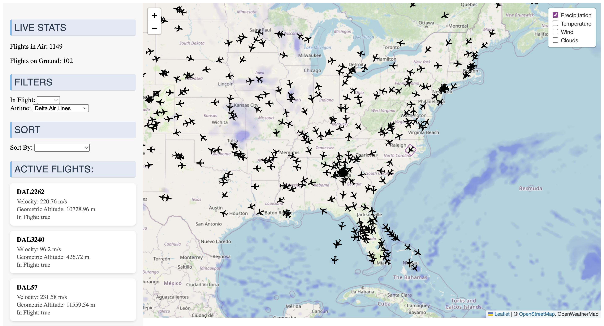

# Live Aviation Data Dashboard  

A real-time dashboard for tracking global flights, built with **FastAPI**, **Python REST APIs**, and a frontend using **HTML, JavaScript, and Leaflet.js**.  

This project processes and visualizes live **aircraft telemetry** and **weather data**, with features like:  
- Real-time flight tracking  
- Filterable flight lists  
- Airline toggles  
- Trajectory plotting  
- Integrated live weather map layers  

---

## Demo  

### Screenshots  

### Weather Overlay  
 

---

### Trajectory Plotting  
 

---

## Tech Stack  

- **Backend:** Python, FastAPI, REST APIs  
- **Frontend:** HTML, JavaScript, Leaflet.js  
- **Data Sources:**  
  - [OpenSky Network API](https://opensky-network.org/) for live flight data  
  - [OpenWeather API](https://openweathermap.org/api) for weather overlays  

---

## Usage Instructions


Follow these steps to run the dashboard locally:  

### 1. Clone the repository  
```bash
git clone https://github.com/gabriella-lewis/flight-dashboard.git
```

### 2. Install dependencies
Install all python packages applicable for this project:
```bash
pip install requirements.txt
```


### 3. Configure API credentials

Create a .env file in the project root with your credentials:

```bash
# .env file
OPEN_SKY_USERNAME=your_opensky_username
OPEN_SKY_PASSWORD=your_opensky_password
WEATHER_API_KEY=your_openweather_api_key
```

OpenSky Network API: Create a free account [here](https://opensky-network.org/)

OpenWeather API: Get a free key [here](https://openweathermap.org/api)

### 4. Run the backend server
```bash
fastapi dev app.py
```


By default, the API will be available at:

http://localhost:8000

### 5. Launch the frontend

Open the frontend file in your browser:

http://localhost:8000/index.html


You should now see the dashboard with live flight and weather data
